# Portfolio Plugin — Screenshots

All screenshots taken against a live Kanboard instance with three demo projects
(**Platform Backend**, **Platform Frontend**, **Platform DevOps**) linked into a
single portfolio (*Q2 Platform Launch*), two milestones (*MVP Release* and
*Public Launch*), nine cross-project tasks with due dates, complexity scores,
and a dependency chain that produces a 5-step critical path.

---

## Portfolio List

The top-level index shows all portfolios, their descriptions, and active status.

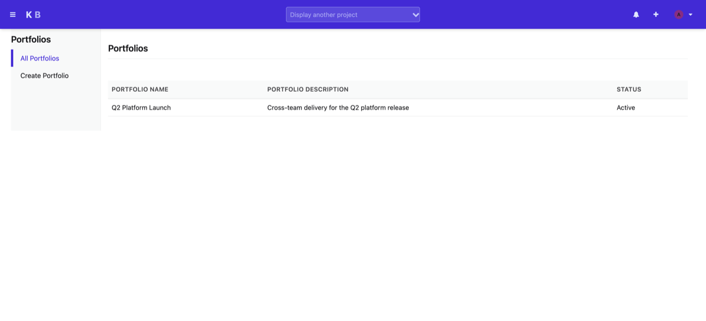

---

## Portfolio Dashboard

The dashboard aggregates key metrics across all member projects in one view:
total/active/blocked tasks, at-risk and overdue milestones, and the computed
critical-path length. Below the metrics grid, **Project Summary** lists member
project statuses and **Milestone Health** shows each milestone's target date,
completion percentage, and health rating.

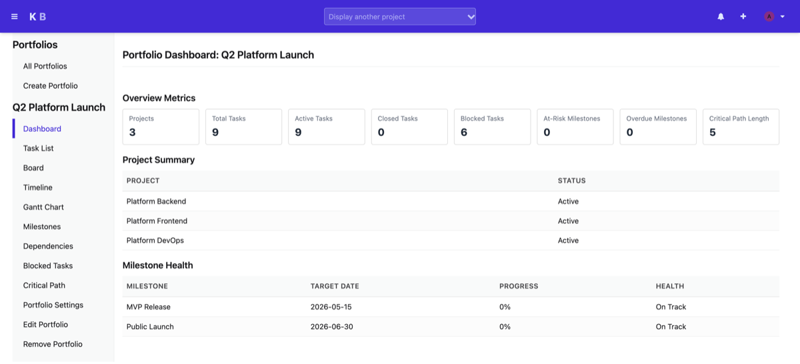

---

## Cross-Project Task List

The unified task list pulls tasks from all member projects into a single
filterable, sortable table. Filters include status, assignee, project,
milestone, and dependency state. Blocked tasks are highlighted with a red badge
showing the blocker count.

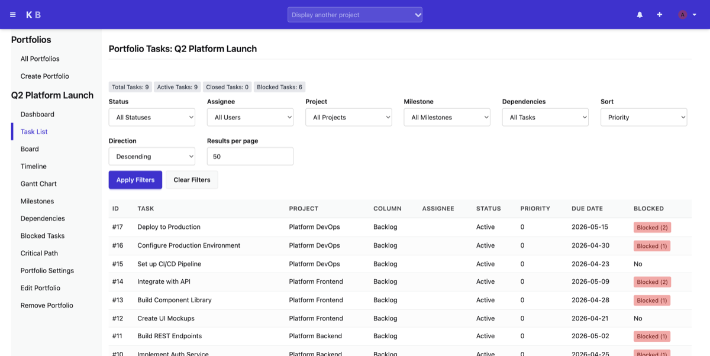

---

## Aggregate Board View

The board groups all portfolio tasks by Kanboard column (e.g. *Not Started* /
*In Progress* / *Done*) across every member project simultaneously. Each card
shows the task number, title, project, assignee, due date, and a blocked badge
when applicable.

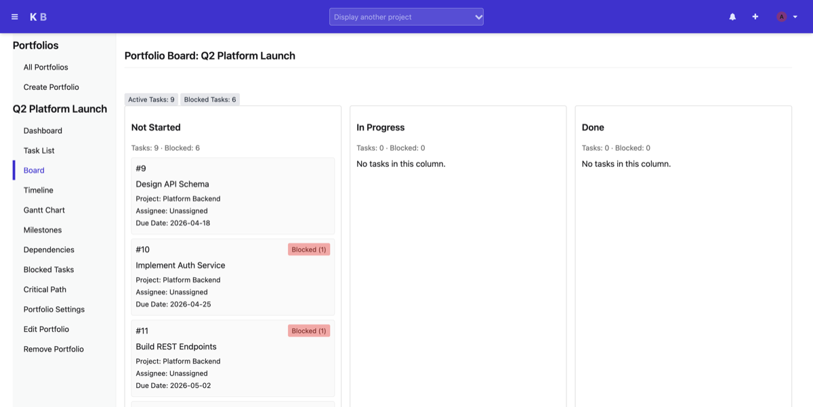

---

## Portfolio Timeline

The timeline renders each task and milestone as a dot on a shared horizontal
time axis, sorted by due date. Milestones appear in amber; tasks are teal.
Below the visual, a detail table lists each item's date, type, title, project,
and status.

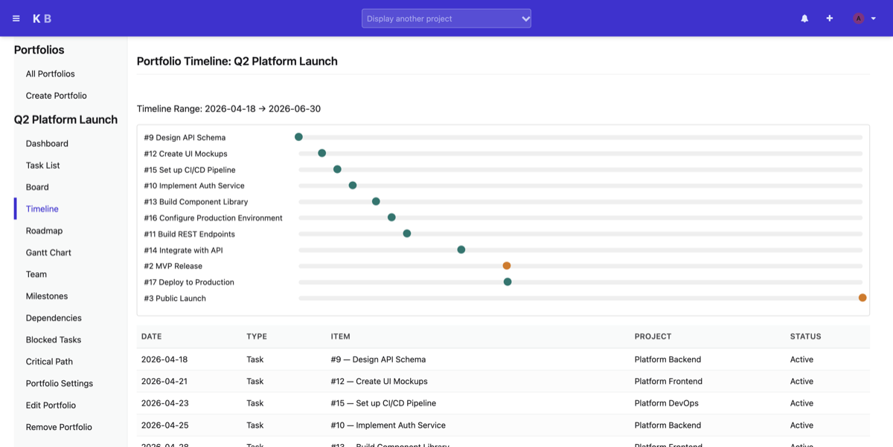

---

## Gantt Chart

The Gantt chart renders task duration bars (coloured by project) and milestone
diamonds on a shared time axis. Dependency arrows connect tasks where one blocks
another, making the critical chain immediately visible.

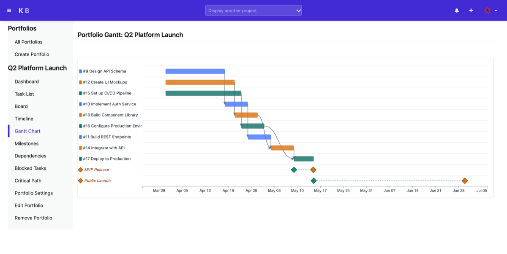

---

## Milestone List

The milestones index lists every milestone in the portfolio with its target
date and task count.

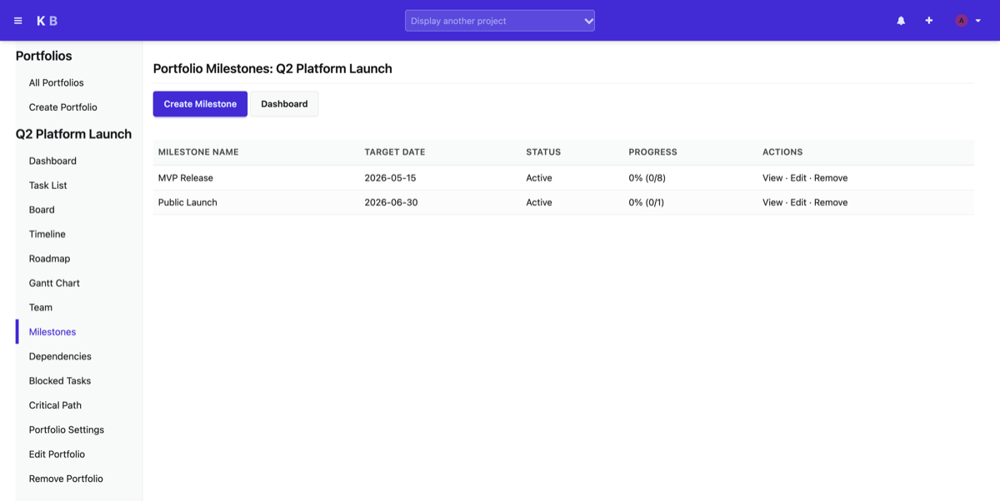

---

## Milestone Detail

The milestone detail page shows progress metrics (total tasks, closed tasks,
percent complete, blocked count, at-risk and overdue flags), an *Add Task* form
with optional critical flag and position, and the full task membership table.

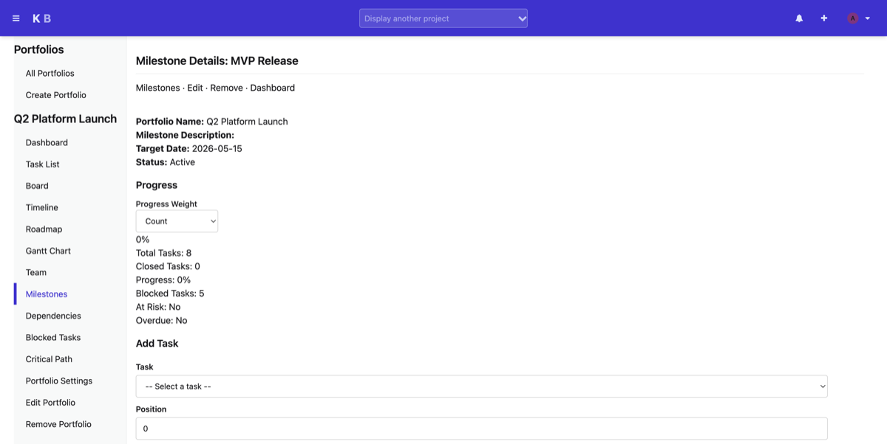

---

## Dependency Graph

The dependency graph uses D3.js to render a force-directed network of
cross-project task relationships. Critical-path tasks are highlighted in red;
regular dependencies appear in blue. The filter toggles between cross-project
only (default) and all dependencies.

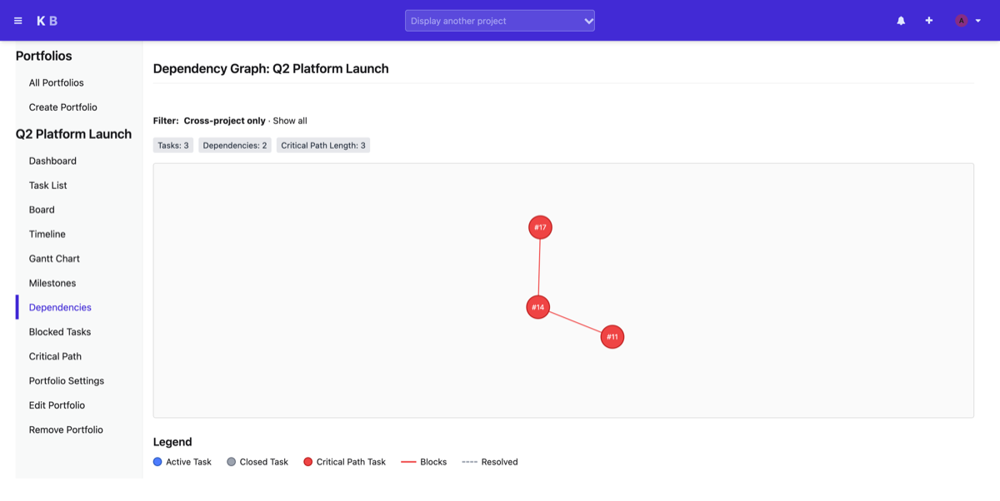

---

## Blocked Tasks

The blocked tasks view lists every task that is currently waiting on at least
one unresolved dependency, grouped by task with each blocker identified by name
and project.

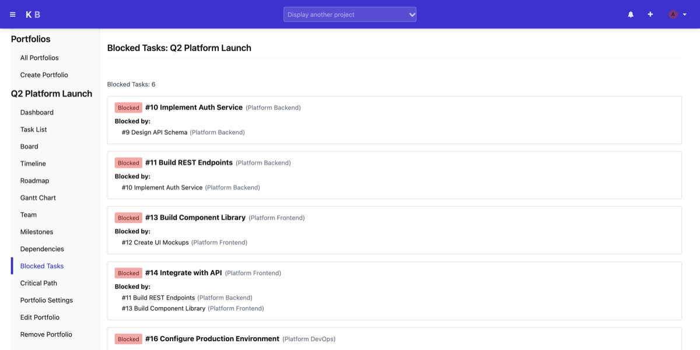

---

## Critical Path

The critical path view computes the longest dependency chain in the portfolio
using topological sort and renders it as a left-to-right flow of task cards.
Each card shows the task ID, title, project, and downstream task count. The
chain in this example runs five steps across three projects.

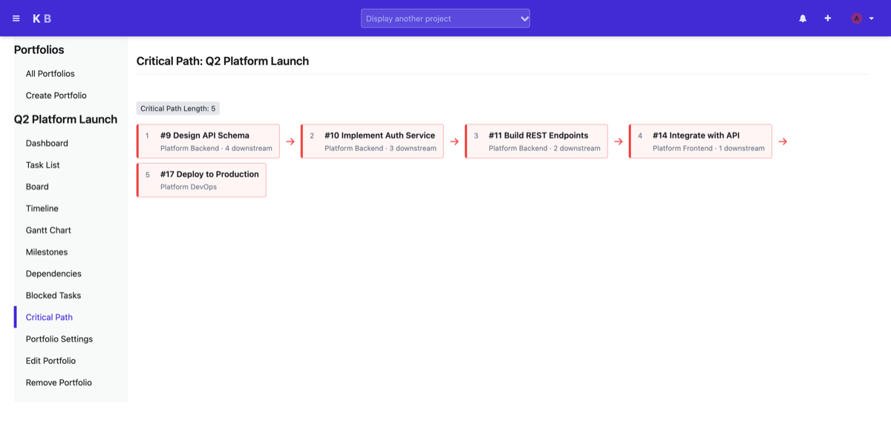

---

## Team Workload

The workload view aggregates active, overdue, blocked, and scored tasks per
assignee. Rows that exceed the configurable overload threshold are flagged with
a warning. An *Unassigned* row captures tasks without an owner.

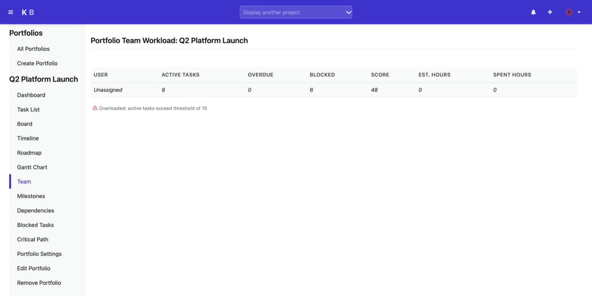

---

## Milestone Roadmap

The roadmap renders each milestone as a horizontal progress bar on a shared
time axis, coloured by health status (green = on track, amber = at risk,
red = overdue). A dashed *Today* line shows where the current date falls
relative to each milestone's window.

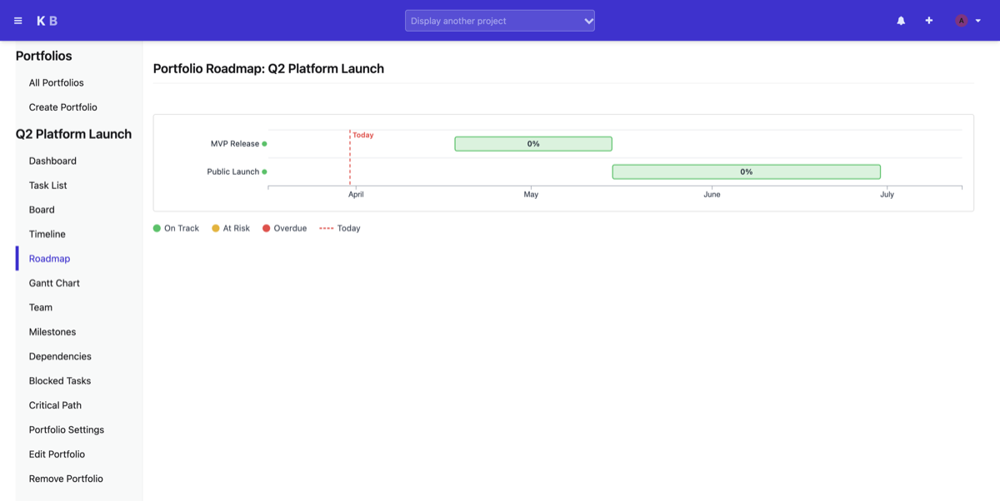
